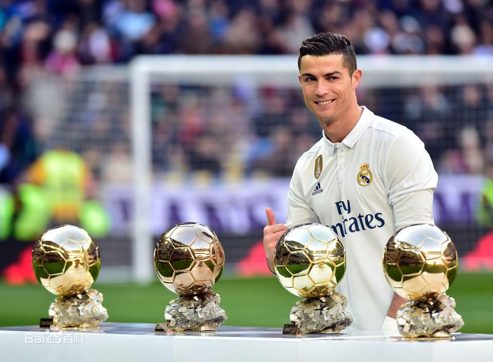
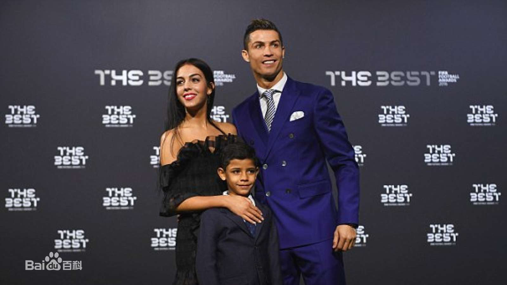
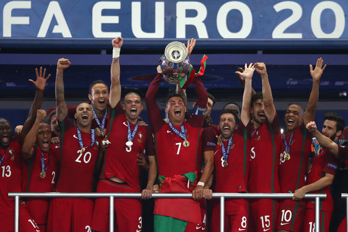

# 克里斯蒂亚诺·罗纳尔多

**个人简历**

*克里斯蒂亚诺*·罗纳尔多（Cristiano Ronaldo），1985年2月5日出生于葡萄牙马德拉岛丰沙尔，葡萄牙足球运动员，司职边锋/中锋，简称C罗，效力于西甲皇家马德里足球俱乐部，并身兼葡萄牙国家队队长。C罗带球速度极快，善于突破和射门，拥有强悍的身体素质，技术非常全面。

C罗出道于里斯本竞技。2003年，加盟英超曼联，期间获得了英格兰足球超级联赛冠军、欧洲冠军联赛冠军、世俱杯冠军等十个赛事冠军。囊获了英超最佳射手、欧冠最佳射手、英格兰足球先生、世界足球先生、金球奖、欧洲金靴奖等个人荣誉。

2009年6月，C罗以身价9600万欧元转会至西甲皇马。前四赛季在199场比赛中201个进球49次助攻，以场均1.01球的进球率成为皇马历史上进球率最高的球员 。2014年1月，C罗获得2013年度国际足联金球奖，8月29日，获得欧洲最佳球员奖。2015年1月，C罗蝉联2014年度国际足联金球奖，是职业生涯中第三次获得金球奖；5月，福布斯公布2014年球员总收入，C罗以7900万美元蝉联第一。2016年7月11日，C罗带领葡萄牙获得2016年法国欧洲杯冠军，这是葡萄牙国家队历史上的第一个国际大赛冠军。2017年1月10日，荣膺2016年国际足联世界足球先生。 2017年10月24日，获得2017年国际足联世界足球先生；入选国际足联2017年度最佳阵容。 12月7日夺得个人职业生涯第5座金球奖 。12月29日，获得环球年度最佳球员奖。 2018年3月19日，获得2017年度最佳男足运动员奖项。 

**感情经历**

2010年7月，C罗更新了自己的facebook，透露了其成为了一个小男孩的爸爸。因为和孩子的母亲有约定，所以对于她的消息C罗只能保密，孩子由C罗监护。
2015年1月，C罗和伊莉娜·莎伊克正式分手，两人5年的恋情宣告结束 。
2017年7月19日，皇马球星C罗接受了西班牙《世界报》的采访，他第一次确认女友乔治娜-罗德里格斯已经怀孕。 11月12日，C罗女友乔治娜在基隆大学医院诞下一女，孩子名为阿拉娜-马尔蒂娜，这也是C罗的第四个孩子。

**慈善活动**

2004年的印度洋大海啸， C罗在电视上看到一个9岁穿着葡萄牙7号的小孩被困19天，深受感触。于是C罗前往印度尼西亚救助难民，多年来C罗一直投身于慈善事业。
2008年，C罗参与了葡萄牙当地5·12汶川地震援助会，C罗在一件葡萄牙国家队球衣上签名，并将签名球衣交与葡萄牙四川地震援助会拍卖，所得款项捐给地震灾区，并呼吁大家一起捐出一份力。

**趣事轶闻**

2005年，C罗的父亲迪尼斯·阿贝罗因为酗酒导致身体恶化而去世，从那时候开始，C罗就很少饮酒，甚至一度戒酒。2008年英国《每日镜报》说C罗在夜店饮酒狂欢、“作乐”，被C罗告上法庭。
2014年12月21日，C罗来到他的家乡葡萄牙的马德拉岛，出席了家乡人民为精心准备的礼物——一个相当于C罗真人大小的铜像揭幕仪式，并被授予了荣誉勋章。C罗在谈到球队2015年的目标时，C罗也是充满了信心。

**人物评价**

速度、盘带、突破、射门、助攻、任意球、头球、电梯球、远射、跑位、意识、力量、身体素质、技术都非常出色，是一名十分全面的足球运动员   。（网易体育评）
C罗吸引人们注意依靠的是他控球和射门的技术，他身材修长，然而那时的他远称不上健硕。渐渐地，C罗在提升自己足球技术的同时，也开始注重打造自己的体型，在身体里注入了力量的因子。（新浪体育评）
C罗招牌式的“踩单车”过人动作、出众的弹跳力和头球技术、力量十足的射门、出神入化的传球，以及在曼联、皇马等豪门俱乐部出色的表现，使他逐渐成为葡萄牙队新的领军人物。（新华网评）
C罗带球速度极快，善于突破和射门，拥有强悍的身体素质，技术非常全面，是当今世界足坛最杰出球星之一。（新华网评）
他是罗纳尔多，却是这世上独一无二的罗纳尔多，是唯一的C罗。他是如此独特，傲娇的不羁，永恒的自信，战斧式的任意球，圆规式的站姿，耀眼的发型，他又是如此的孤独，像一个守夜人，拖着一支受伤的腿来到巴西，一个人扛起一个国家的梦想。遗憾的是最终留给我们的，是那个回望球场的眼神，是传奇7号的背影。（凤凰网评）
C罗是我曾经签下的球员中最出色的一个，作为一个边路攻击者，能在一个赛季里打进20个进球，这是让人难以置信的。毫无疑问，他已经达到了当今世界的最佳。当今足坛我只会为一个人花出6000万英镑，那就是C罗。他是个出色、喜欢接受挑战的球员，他在曼联的贡献，我们永远不会忘记。（前曼联队主教练弗格森评）
C罗有能力成为一名超级巨星。（前国际足联主席布拉特评）
每一位教练都希望能够拥有像他这样出色的球员在阵。（前皇马主教练穆里尼奥评）
